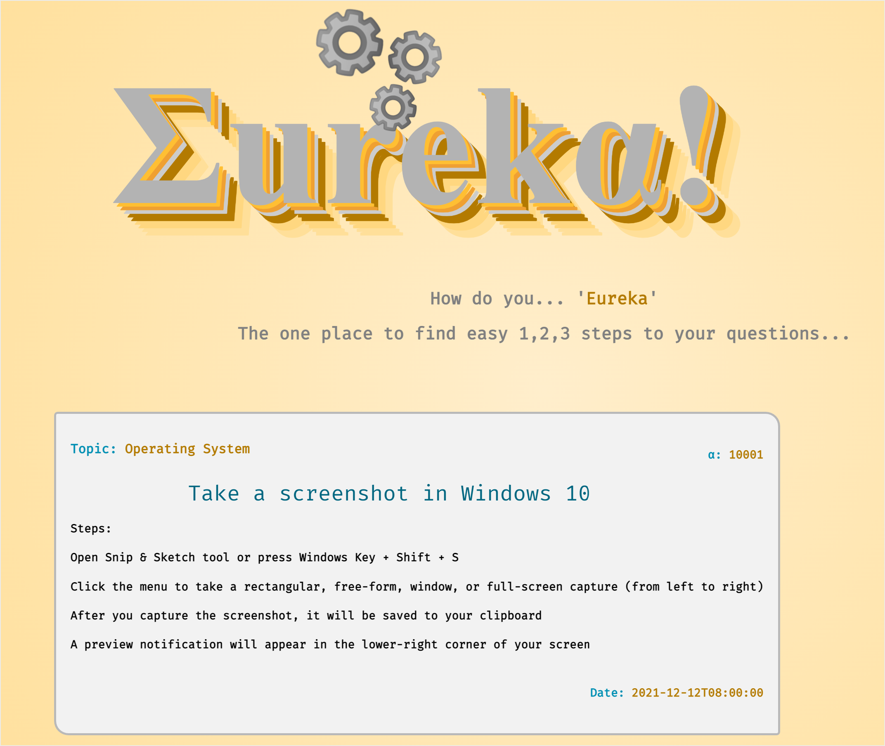
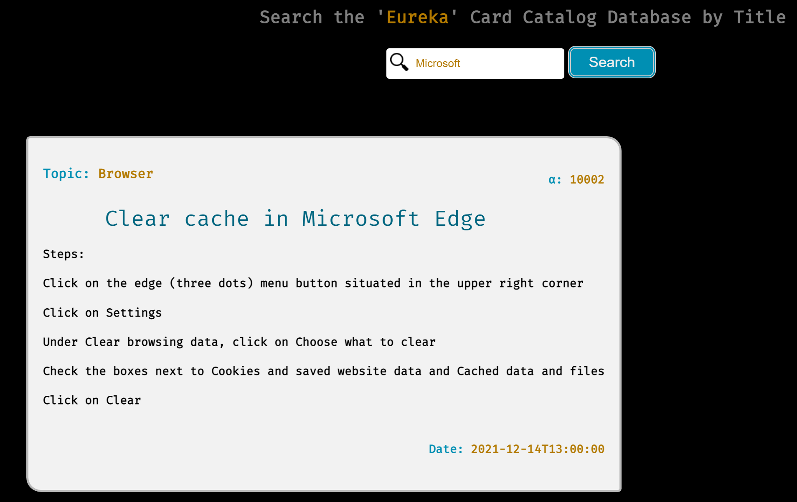

# Eureka!

### Name: Syed Malik

 

## What is `Eureka!`?

---

`Eureka!` is an application where we can go to find the answers to our basics questions. This application will be your one stop place to find quick answers to questions. The information will be displayed in a **catalog card format** with steps in short concise format.

  

## Eureka Application

---

The `Eureka` frontend applicaton is written with React JavaScript library. The application pulls data from a ASP.NET Web API and displays the information in a clear organized manner.

 

## Development

---

- Clone repository
- React server is setup on [localhost:5500](http://localhost:5500)
- Main directory run command '**npm install**'
- Main directory run command '**npm start**'

 

## Documentation:

---

If you would like to make changes to localhost port. The changes can be made in the package.json file under scripts.  
Note: Web API is currently only setup to allow CORS on 'http://localhost:5500'

 

  

## Additional Feature:

---

Added the ability to search the database and pull catalog items by Title.

 

## Licence

---

`Eureka!` is [MIT Licenced](LICENSE.md)
